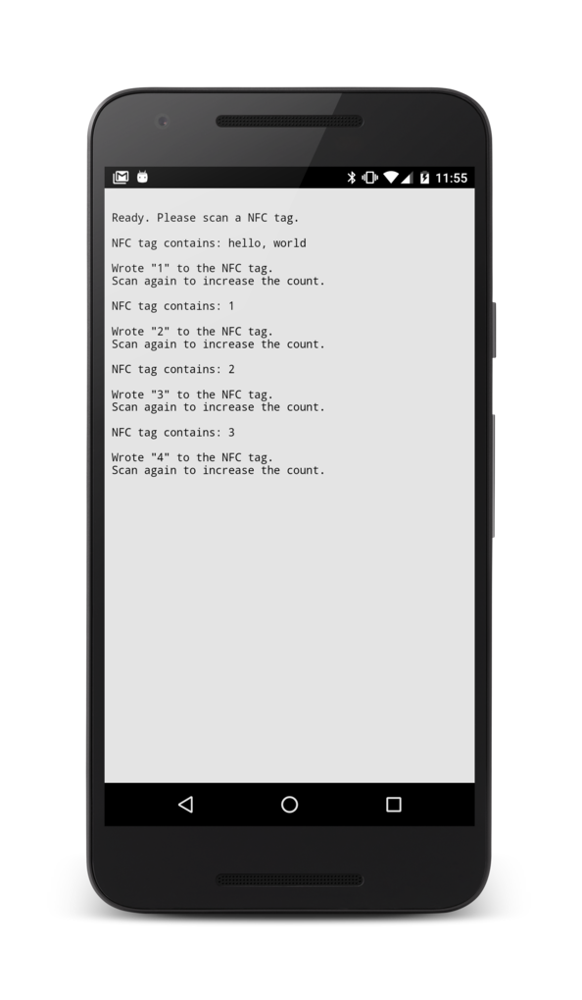

## PhoneGap NFC Read Write Example

Read the value from an NFC tag and write a new value to the tag.

### Install

    $ git clone https://github.com/don/phonegap-nfc-read-write.git
    $ cd phonegap-nfc-read-write
    $ cordova platform add android
    $ cordova run android --device
